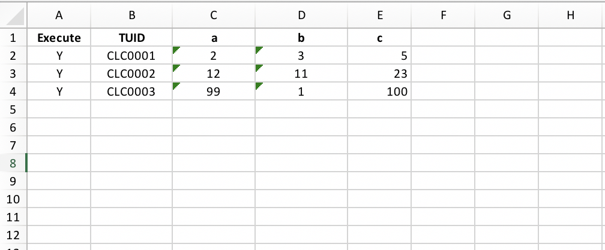

#Dataproviders

Carina test framework provides possibility to write all tests with data providers in one place include parametrization using external XLS/ XLSX/ CSV spreadsheets, TestNG `@DataProvider` and `@Parameters` annotations.

First of all you need to declare test class that extends `AbstractTest.java` and define test suite in xml document for it.
After that you can specify data providers tests as follows.

## XLS / XLSX / CSV data provider parametrization
For XLS/ XLSX/ CSV spreadsheets look at the following code snippet:

```java
@Test(dataProvider = "DataProvider", description = "your_description")
	@MethodOwner(owner="your_name")
	@XlsDataSourceParameters(path = "xls/demo.xlsx", sheet = "Calculator", dsUid = "TUID", dsArgs = "a,b,c")
	public void testSumOperation(String a, String b, String c)
	{
		int actual = Integer.valueOf(a) + Integer.valueOf(b);
		int expected = Integer.valueOf(c);
		Assert.assertEquals(actual, expected, "Invalid sum result!");
	}

```

This test uses XLS/ XLSX/ CSV files as data sourse. Every row in a spreadsheet is a set of arguments for a test. You should specify the `dataProvider` parameter for TestNG annotation `@Test` . Carina test framework initially defines several data providers methods in `AbstractTest.java`, which you've extended earlier:

* createData method (data provider name = "DataProvider") for common usecases

* createDataSingeThread method (data provider name = "SingleDataProvider") for single-thread execution.

To specify XLS/ XLSX/ CSV spreadsheets for test you should declare `@XlsDataSourceParameters` annotaion and define its parameters:

* path - file path located in src/test/resources
* sheet - sheet name
* dsUid - data-source unique identifier
* dsArgs - column names from sheet

Here you can look at the spreadsheet as a data provider example for your further tests:



In TUID column you shoud specify your UID. In further columns you can specify arguments for a test and their values in lower rows. They will be used as parameters in `@XlsDataSourceParameters`. In this example values of a,b,c arguments were defined in 3 sets of values with different TUID.

##TestNG data provider parametrization
Next lets take a look at widely used TestNG Data Provider parametrization. In this case there are common rules for writing this kind of tests:

* create data-provider method that returns `Object[][]` and set DataProvider annotation.
* specify data-provider name in `@Test` annotation

Example:

```java
@Test(dataProvider = "DP1", description = "your_description")
	@MethodOwner(owner="your_name")
	public void testMuliplyOperation(int a, int b, int c)
	{
		int actual = a * b;
		int expected = c;
		Assert.assertEquals(actual, expected, "Invalid sum result!");
	}

	@DataProvider(parallel = false, name = "DP1")
	public static Object[][] dataprovider()
	{
		return new Object[][]
		{
				{ 2, 3, 6 },
				{ 6, 6, 36 },
				{ 5, 8, 40 } };
	}

```

Besides you can use TestNG annotation `@Parameters` for listig all parameter names as in the following code snippet:

```java
@Test(description = "your_description")
	@MethodOwner(owner="your_name")
	@Parameters(
	{ "a", "b", "c" })
	public void testSubstractOperation(int a, int b, int c)
	{
		int actual = Integer.valueOf(a) - Integer.valueOf(b);
		int expected = Integer.valueOf(c);
		Assert.assertEquals(actual, expected, "Invalid substract result!");
	}
```

All of these tests can be consolidated under single java class as it's shown in our [demo](https://github.com/qaprosoft/carina-demo) of Carina test framework, where you can find `DataprovidersSampleTest.java`


