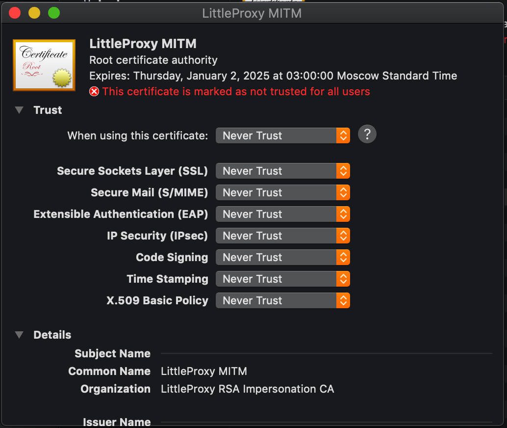

### Raising inbuilt proxy-server
There is inbuilt proxy-server library BrowserMobProxy in carina-proxy module. By default it is being started on any free port and requires following properties in your **config.properties** file:
```
browsermob_proxy=true
browsermob_disabled_mitm=false
```
First property **browsermob_proxy** will start proxy instance on every test method start. Second property **browsermob_disabled_mitm** is needed to be set to false to declare enable working with **https**.

#### Using proxy-server in java code:

1. Create driver instance first:
```
getDriver();
```
2. Then create proxy instance (all necessary capabilities will be set into created driver):
```
BrowserMobProxy proxy = ProxyPool.getProxy();
```
3. Setting captured content type:
```
proxy.enableHarCaptureTypes(CaptureType.REQUEST_CONTENT, CaptureType.RESPONSE_CONTENT);
```
There are a lot of possible content types:
```
CaptureType.RESPONSE_COOKIES
CaptureType.RESPONSE_HEADERS
CaptureType.REQUEST_HEADERS
CaptureType.RESPONSE_CONTENT
CaptureType.REQUEST_CONTENT
...
```
They all can be set as comma separated parameters.

4. You may want to save captured content into a .har file:
```
proxy.newHar(HAR_NAME);

//Some testing activity...

proxy.stop();

//Saving har to a file...
File file = new File(HAR_NAME + ".har");
Assert.assertNotNull(proxy.getHar(), "Har is NULL!");

        try {
            proxy.getHar().writeTo(file);
        } catch (IOException e) {
            e.printStackTrace();
        }
```
Your .har file will be created in project root folder

5. There are four methods to support request and response interception:

* addRequestFilter
* addResponseFilter
* addFirstHttpFilterFactory
* addLastHttpFilterFactory

To add and configure content filters look [here](https://github.com/lightbody/browsermob-proxy#http-request-manipulation).

#### Dealing with MITM and installing SSL sertificate into your system:

##### For Mac users:

1. Go [here](https://github.com/lightbody/browsermob-proxy/blob/master/browsermob-core/src/main/resources/sslSupport/ca-certificate-rsa.cer) and save it as **ca-certificate-rsa.cer**.
2. Double click created file. Next window should be shown:


3. After authorization the certificate will be added into your system certificates,  but it's still untrusted:


4. To make it trusted double click on it. Following window should be shown:



5. Click first drop-down menu and select **Always Trust** option. Then close the window (second authorization will be required):


6. Make sure red cross on your certificate turned into a blue one:


